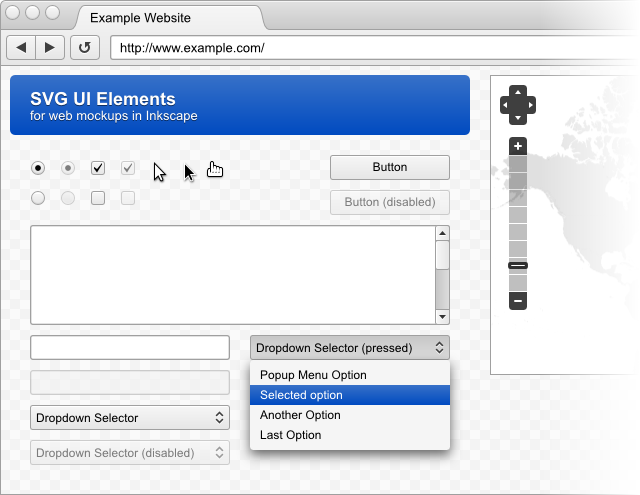

Inkscape Mockup Toolkit
===============================================================================

*SVG UI Elements for Web Design in Inkscape*

This is a collection of UI elements in SVG format, for use in the creation of 
design mockups. It is tailored for use with [Inkscape][1], but may be useful in
other software that can read SVG files.

While the elements are scalable vector objects, they are designed with the 
pixel grid in mind. Most objects will scale best when snapping is enabled and 
set to bounding box corners or edges. The scaling of stroke-width and border-
radii should also be disabled.

Objects are grouped for easier copying and pasting across documents, though to
scale most objects you should either enter the group (double-click it) or 
un-group it (CTRL-U).

[1]: http://inkscape.org/

## License

[CC0](http://creativecommons.org/publicdomain/zero/1.0/)
